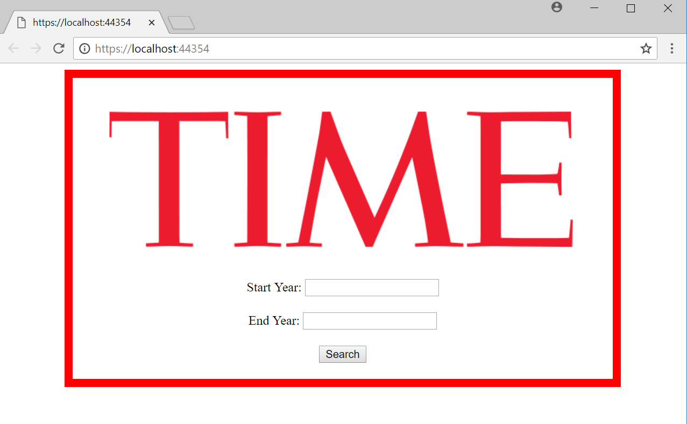

# Lab11_MVC_App
An MVC application using .NET Framework. User can enter a starting 
year and an end year. After hitting the search button, the user is 
then sent to another page with a table of all the Time Person of the 
Year listed. Their year, name, reason for the title and other 
information are displayed. The data is from a csv file. 

## What you need
* Install the latest Visual Studio 2017
* Have Windows OS on your device

## How to Open App
* Fork the Lab11_MVC_App repo from [my GitHub Page](https://github.com/Calamario)
* Git Clone the repo onto your local device
* Open .sln file with Visual Studio
* Click on the green arrow to start
* Upon starting, it will open a web page using local host.

## Special Thanks
Image is taken from Time Magazine

## What it looks like
